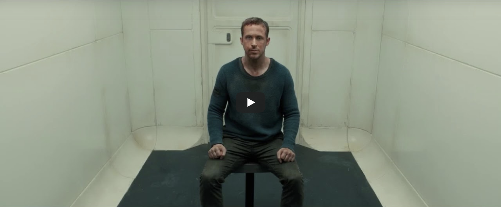

# Web-typografie
Minor visual interface design 3.1 2019/2020

# Opdracht
Horen is voor mensen een erg belangrijk zintuig. Geluid geeft informatie, gevoel en karakter. Wanneer iemand doof is of om een andere reden geen geluid kan horen mist die persoon veel informatie. Bijvoorbeeld het kijken van een film zonder geluid is een hele andere ervaring. Er bestaat een begrip genaamd closed-captions waarbij de geluiden en muziek beschreven worden. Dit geeft de kijker van de film wel meer informatie maar er is nog veel winst op te behalen.

Voor de opdracht van dit vak heb ik een scene uit de film 'Blade runner 2049' aangepast zodat deze toegankelijk is voor Darice de Cuba. Darice is een vrouw en is op haar 27e doof geworden. Doordat Darice doof is gaat ze niet naar de bioscoop en kijkt daarom het liefste thuis een film, maar helaas licht de nadruk niet op toegankelijkheid bij het lezen van de close-captions.
Darice ervaart hierdoor de films niet zoals mensen met gehoor dit zouden doen. Actie films vallen niet in de smaak omdat hier veel geluiden in voorkomen. Darice haar voorkeur gaat naar films waarbij veel gepraat wordt zodat het nog enigszins amuserend is.

Ik heb de ondertiteling en geluidseffecten op een visuele manier weergegeven zodat de film ook zonder geluid karakter heeft.

# Font keuze
Ik heb gekozen om voor de tekst van de closed-captions gebruik te maken van het lettertype Brenner. Brenner is een zeer uitgebreid lettertype met veel variaties in uiterlijk. Door te kiezen voor de Brenner font wil ik meer karakter geven aan bepaalde zinnen of woorden. Door het gebruik van een systeemfont zou dit bijvoorbeeld niet mogelijk zijn. Wanneer er voor een hele drukke visualisatie gekozen zou zijn zou een systeemfont wel meer rust kunnen brengen in de video. Voor de ervaring van Darice heeft het echter een meerwaarde om gebruik te maken van verschillende font variaties.

# Feedback sessies
Gedurende het vak zijn er verschillende feedback sessies georganiseerd waarbij ik verbeterpunten heb ontvangen op mijn uitwerking. Tijdens de feedback sessies heb ik mijn uitwerking kunnen testen met mijn docent, Vasilis van Gemert en met Darice de Cuba. Een aantal punten die uit de feedback is gekomen die ik later heb aangepast staan hieronder op een rijtje.

Vasilis:
* Meer gelijkheid in de visuele effecten
* Gele kleur van de naamtag vernaderen want moeilijk leesbaar
* Interessante visualisatie met de sliding doors
* Meer gebruik maken van fontkeuze

Darice:
* Closed captions toevoegen bij geluiden
* Interlinked 3 keer herhalen
* Een naam tag toevoegen voor de zinnen zodat ze weet welke persoon wat zegt
* De intercom stem beter visualiseren
* Het inzoomen op de computer tijdens het interview trekt haar goed in de film
* De sliding doors vind zij geen goed effect en ziet zij liever niet

# Onderbouwing

### Typografie 
* Keuze gemaakt voor Brenner font om meer karakter aan de tekst te geven.
* Gekozen om voor elke zin een naam tag te plaatsen zodat duidelijk is welke persoon wat zegt.
* De tekst van de interviewer is italic en de tekst van Constant K (de hoofdpersoon) is normal.
* De tekst van de intercom is Brenner Mono en heeft een letter spacing om het een mechanische uitstraling te geven.
* Om de closed-captions van de geluiden te onderscheiden hebben deze een grotere font-size

### Verdeling
* De video heb ik in het midden van het scherm geplaatst zodat de aandacht hierop gevestigd wordt.
* De closed captions zijn onder de video gepositioneerd omdat dit prettig leest voor Darice.

### Beweging
* Er zijn verschillende bewegingseffecten toegevoegd om verschillende geluiden te visualiseren.
* Aan het begin trilt het beeld om een onheilspellende sfeer te creeëren.
* Bij het geluid van alarmen zoomt het beeld in om een ease-in-out effect te bereiken.
* Bij het geluid van alarmen heeft de closed-caption een glitch effect om de noodsituatie te benadrukken.
* Tijdens het interview komt het beeld linear dichterbij om zo de kijker meer in de film te betrekken.
* Na het eerste interview trilt het beeld om weer onheilspelling te visualiseren, dit keer op een iets andere manier dan op het begin.

### Kleur
* Ik heb de keuze gemaakt om de achtergrond zwart te maken omdat de uitgewerkte scene een duistere sfeer heeft.
* De naam tags van de closed-captions bevatten per personage een aparte kleur, hierdoor is er beter onderscheid te maken in de verschillende stemmen.
* Wanneer er geluiden van een alarm te horen zijn zal de achtergrond rood kleuren om het alarm te visualiseren.
* Op het moment dat er een hoge toon te horen is zal de achtergrondkleur lichter worden omdat een lichte kleur een illusie geeft voor een hoge toon.
* Om te onderscheiden wanneer er een stilte is zal de achtergrondkleur geheel wit zijn.

# Bronnen
* [Github setup](https://github.com/cmda-minor-vid/web-typography-19-20)
* [CSS animation](https://www.w3schools.com/css/css3_animations.asp)
* [Keyframes](https://css-tricks.com/snippets/css/keyframe-animation-syntax/)
* [nth-child](https://css-tricks.com/useful-nth-child-recipies/)
